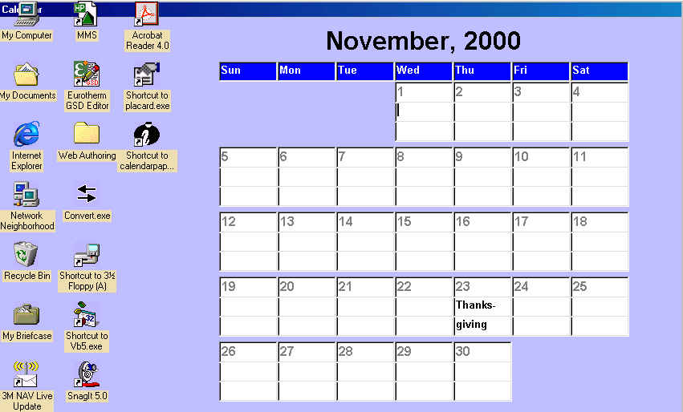



## CalendarPaper

### Description

Here's something I needed in a hurry ... so I took a program from Sparq (create a calendar), a program from Patrick Moore (screenshot saver), and a program from Ian Ippolito (make wallpaper). I combined them to create a calendar for wallpaper that I can enter comments in for each day. The calendar is always there as my wallpaper ... thanks to those three authors, I didn't have to write them all myself. I won't miss any more appointments now.
 
### More Info
 

             |
---                |---
**Submitted On**   |2000-11-10 12:41:44
**By**             |[Max Seim](https://github.com/Planet-Source-Code/PSCIndex/blob/master/ByAuthor/max-seim.md)
**Level**          |Intermediate
**User Rating**    |4.0 (8 globes from 2 users)
**Compatibility**  |VB 5\.0, VB 6\.0
**Category**       |[Complete Applications](https://github.com/Planet-Source-Code/PSCIndex/blob/master/ByCategory/complete-applications__1-27.md)
**World**          |[Visual Basic](https://github.com/Planet-Source-Code/PSCIndex/blob/master/ByWorld/visual-basic.md)
**Archive File**   |[CODE\_UPLOAD1155811102000\.zip](https://github.com/Planet-Source-Code/max-seim-calendarpaper__1-12688/archive/master.zip)

